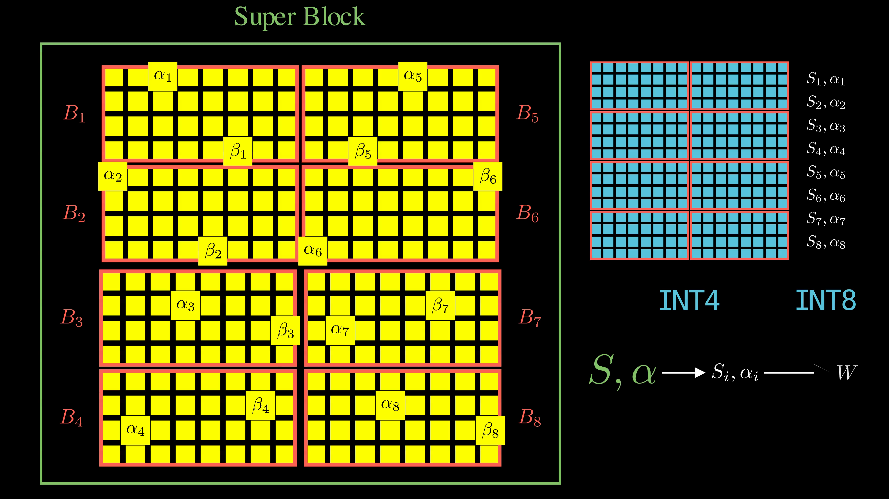
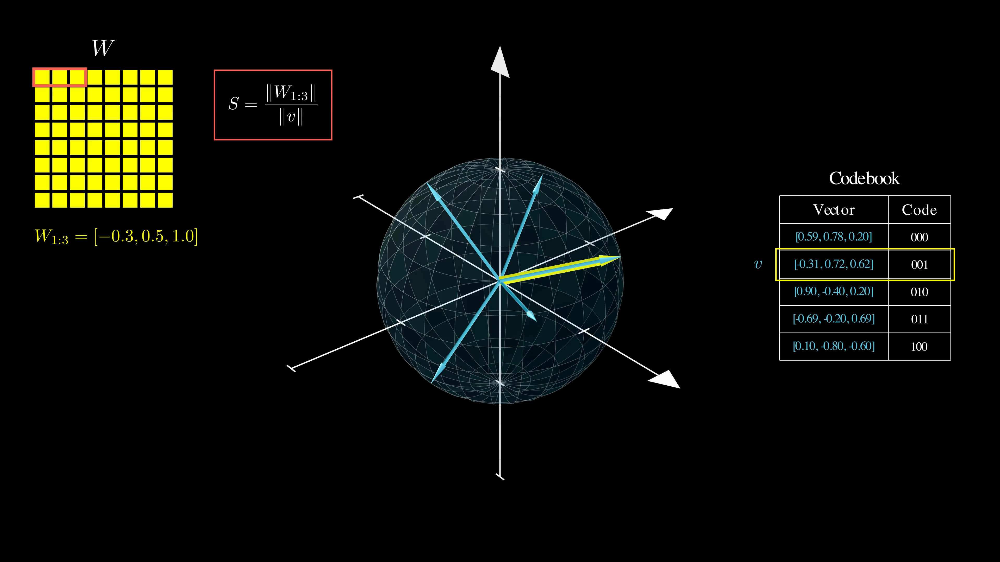
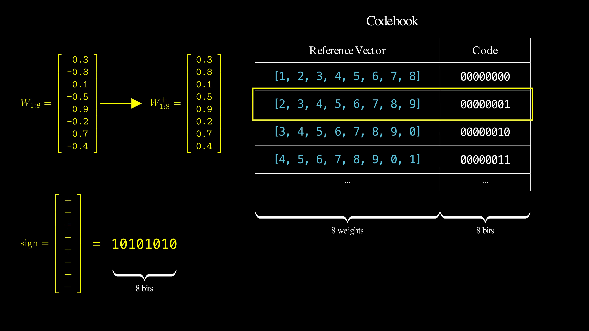
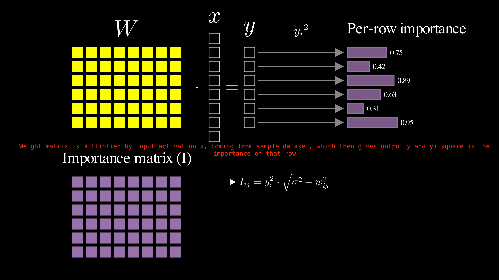

There are two types of quantization methods on the basis of type of machine you are using:
1. CPU
The best quantization framework for CPU inference is llama.cpp, which utilizes the GGUF.
2. GPU
For GPU quantization, top frameworks include NVIDIA TensorRT-ModelOpt for maximum inference speed, and AutoGPTQ/AutoAWQ for ease-of-use with LLMs. QLoRA (via bitsandbytes) is best for training, while GPTQ/AWQ are ideal for post-training 4-bit inference, ensuring minimal accuracy loss with high throughput on NVIDIA hardware

# GGUF 
GGUF quantization implements Post-Training Quantization (PTQ): given an already-trained Llama-like model in high precision, it reduces the bit width of each individual weight. The resulting checkpoint requires less memory and thus facillitates inference on consumer-grade hardware.

There are 3 quantization methods

## Legacy Quantization Methods
Legacy quantization methods are the first generation of quantization algorithms in llama.cpp. Even though they are deprecated as standalone quantization methods, they remain relevant because their successors (K-quants and I-quants) build upon them rather than replace them entirely.
Legacy quants use affine quantization, mapping each floating-point scalar weight to a lower-bit integer.

Legacy quants come in two main subcategories that correspond to symmetric and asymmetric quantization:
### Type 0 (Symmetric QUantization)
  - Type 0 (symmetric)

    
    

- Type 1 (asymmetric)
Type 1 quantization uses asymmetric quantization: it uses integer bins more effectively, even when the weight clipping range is not symmetric (e.g. [-1, +2]).


Block Quantization


## K-Quants
 Double Quantization : quantize the quantization constants themselves.
 
 Instead of storing quantization constants in full precision, K-quants quantize them too, creating a two-level hierarchical quantization scheme that dramatically reduces storage overhead.

 Legacy quants require quantization constants (scale and optional offset) for each block of 32 weights. For a 16B parameter model, these constants consume about 2GB of storage on top of the quantized weights. K-quants reduce this overhead.  
 K-quants group 8 regular blocks into one super-block, creating a two-level hierarchy:

 1. Regular blocks: Still contain 32 quantized weights each (e.g., INT4)
 2. Block constants: Scale and offset for each regular block, now stored as INT8 (quantized!)
 3. Super-block constants: One pair of FP16 constants to dequantize the block constants
 For a 16B-parameter model, this reduces storage overhead from 2GB to ~1GB.

 ### Mixed Precision Strategy
 K-quants implement mixed precision quantization: not all weights get quantized to the advertised bit width. Critical components receive higher precision:

 - Layer normalization weights: Often kept in FP16
 - Attention weights: Allocated higher precision (Q5_0, Q6_K, etc.)
 - Output layer: May use higher precision than base quantization

## I-Quants
I-quants are the third generation of quantization algorithms in llama.cpp, marking a significant conceptual departure from both legacy quants and K-quants. While previous methods used uniform scalar quantization, I-quants introduce vector quantization and the option to take weight importance into account when quantizing.

So basically we have a set of reference vectors(known as codebook), for any weight matrix vector we want to quantize, we look it's nearest neighbour from the set of reference vector and keep that direction(along with the original weight's magnitude)




## Scalar vs vector quantization

### Scalar quantization
Traditional quants ([legacy](legacy-quants.md) and [K-quants](k-quants.md)) quantize individual weights. This is *scalar* quantization:
```
w_i → integer_quant
```

### Vector quantization
In contrast, I-quants treat groups of 8 weights as indivisible. This is *vector* quantization:
```
w_vec = [w_1, w_2, ..., w_8] → integer_quant
```

Vector quantization is facillitated by a *codebook* of *reference* (or *prototype*) vectors, with entries of this form:
```
r_vec = [r_1, r_2, ..., r_8] → integer_code
```

## (Simplified) vector quantization algorithm
Conceptually, this is how a weight vector `w_vec` is quantized. In practice, there are additional optimizations (discussed in the next sections).

1. Find its nearest neighbor `r_vec` in the codebook
2. Calculate a scale `S = |w_vec| / |r_vec|`
3. Store:
  
    a. the *code* associated with `r_vec`, and 

    b. the scale `S`, which is shared across 256 vectors, similarly to the [Block Quantization](legacy-quants.md#block-quantization) method from legacy and K-quants.

While storing the scale allows us to recover the original magnitude of the weight vector, its exact orientation is forever lost. This means the codebook needs to cover as many angles of the 8-dimensional space as possible.

## Codebook design



It's not clear how the reference vectors were chosen. They are simply hard-coded in [ggml-quants.h](https://github.com/ggml-org/llama.cpp/blob/0d9226763c82562186122f3b827fa3862864a19c/ggml/src/ggml-common.h#L482). In this file, every 8D codebook vector is encoded as single hexadecimal value, which obfuscates it from the casual reader. To make matters worse, the algorithm that decodes the hexadecimals into 8D vectors seems to differ based on the exact quant sub-type.

In [this PR](https://github.com/ggml-org/llama.cpp/pull/4773), Kawrakow cites the [QuIP#](https://arxiv.org/abs/2402.04396) paper as a source of inspiration. QuIP# borrows the reference vectors from the [E8 lattice](https://en.wikipedia.org/wiki/E8_lattice) (a collection of 240 8D vectors that are borderline mystical and were connected to the theory of everything!). However, there is no evidence in the code that they actually used the E8 lattice (likely, they cited QuIP# as an inspiration for vector quantization at large).

### Codebook optimization: the sign trick
This is a clever trick that keeps the codebook size small:
- Reference vectors are exclusively *positive*, in all dimensions.
- Instead of querying the codebook with `w_vec`, GGUF searches for the nearest neighbor of its absolute-value vector (i.e. flips the negative signs).
- Once the nearest `r_vec` is identified, the following are stored:

    a. the *code* associated with `r_vec` in the codebook (as above);

    b. the scale `S` (as above);

    c. the signs of the original `w_vec` dimensions, which can be neatly packed in a single byte, e.g. `0b01010101` means `w_vec` alternates positive and negative signs.

The additional sign byte increases storage requirements, but also increases the size of the codebook by a factor of `2^8 = 256`. Keeping the stored codebook small means less storage for the codebook and faster nearest neighbor search.

## Ultra-low bit rates
Even with the sign byte, I-quants achieve better compression rate than their predecessors. For instance, given:
- 8-dimensional vectors => **8 bits for signs**
- stored codebook size of 256 => **8-bit codes** (and *actual* codebook size = 256 * 256 = 65,536)
- FP16 scale `S` shared across 256 vectors (i.e. 2048 weights) => *0.008 bits for scale*

we get a compression rate of 2.008 bpw.

⚠️ This number might not be *entirely* accurate because GGUF uses more optimization tricks, especially for bit packing, but... give or take, this is the rough math behind `IQ2` quants.


# Importance Matrix
The core insight is that not all model weights are equally important. A weight is important if changing it by a small amount causes disproportionately large changes in the model output. Such weights should be allocated more precision. As we'll see soon, "allocating more precision" doesn't mean allocating more bits, but rather choosing the quantization constants (the scale S and zero-point Z if present) in a way that favors the important weights. 


Further details [here](https://github.com/iuliaturc/gguf-docs/blob/main/importance-matrix.md)